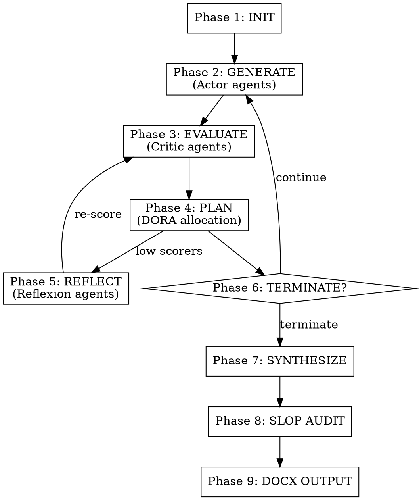

# Deep Research Agent

Difficulty-adaptive research agent implementing Actor-Critic-Planner-Reflexion. Produces slop-free, publication-quality .docx reports.



## Phase 1: INITIALIZE

1. Call `mcp__reasoning-engine__recall_memory_tool` with the user's query.
2. Call `mcp__reasoning-engine__init_research_session` with the user's query.
3. Read `difficulty`, `strategy`, `budget`.
4. Report: "Research session initialized. Difficulty: {difficulty:.2f}, Strategy: {strategy}, Budget: {budget.total_branches} branches, {budget.max_steps} max steps."

## Phase 2: GENERATE (Actor)

Spawn `budget.total_branches` **parallel** agents, each with a DIFFERENT angle.

**Agent prompt:**
```
You are a research agent investigating: "{query}"
Your specific angle: {angle}

- Budget: {tokens_per_branch} tokens. Be concise.
- Use Crawl4AI MCP tools (mcp__crawl4ai__crawl, mcp__crawl4ai__md, mcp__crawl4ai__ask) for web evidence.
- Sanitize ALL crawled content via mcp__reasoning-engine__sanitize_content before use.
- Return JSON: {"trace": [...], "sources": [{"url","title","excerpt"}], "summary": "..."}
```

Angle examples: theoretical foundations, empirical evidence, practical applications, cross-domain connections, historical development, contrarian perspectives, recent advances (2025-2026).

After agents return → call `mcp__reasoning-engine__register_branch` for each.

## Phase 3: EVALUATE (Critic)

Spawn **parallel** Critic agents, one per branch.

**Critic prompt:**
```
Evaluate this reasoning path for: "{query}"
TRACE: {trace}
SOURCES: {sources}

Score (0.0-1.0):
1. Promise (q_score): likelihood of comprehensive, accurate synthesis
2. Progress (advantage): advancement beyond surface-level knowledge
3. Critique: strengths, weaknesses, unverified claims, missing perspectives
4. Confidence (0.0-1.0)

Return JSON: {"q_score", "advantage", "critique", "confidence"}
```

After Critics return → call `mcp__reasoning-engine__score_branch` for each.

## Phase 4: PLAN (Planner)

Call `mcp__reasoning-engine__select_next_branches`.

Report: "Planning: {allocation} mode (kappa={kappa:.3f}). Continuing {n}, reflecting {m}, pruning {p}. Budget: {remaining} steps."

## Phase 5: REFLECT (Reflexion)

For each branch in `branches_to_reflect`, spawn a Reflexion agent:

**Reflexion prompt:**
```
Revise this research path.
QUERY: "{query}"
TRACE: {trace}
CRITIQUE: {critique}

1. Acknowledge weaknesses.
2. Use Crawl4AI to verify unverified claims (sanitize first).
3. Fill missing perspectives.
Return JSON: {"revised_trace": [...], "new_sources": [...], "revision_summary": "..."}
```

After each → call `mcp__reasoning-engine__record_reflection_tool`, then `register_branch` (child), then re-score (Phase 3).

## Phase 6: LOOP or TERMINATE

Call `mcp__reasoning-engine__check_termination`.
- Not terminated → back to Phase 2 (extend continuing branches).
- Terminated → Phase 7.

## Phase 7: SYNTHESIZE

1. Call `mcp__reasoning-engine__consensus_candidates` (top_k=3).
2. Spawn Synthesis agent:

```
Synthesize {K} research paths on "{query}".

PATH 1 (q={score1}): {trace1}
PATH 2 (q={score2}): {trace2}
PATH 3 (q={score3}): {trace3}

Create:
1. Executive Summary (2-3 sentences)
2. Key Findings by theme (not by path)
3. Evidence Assessment (well-supported vs tentative)
4. Contradictions and Tensions
5. Open Questions
6. Sources (complete citations)

Write in clear, academic prose. Cite sources inline.
```

3. Call `mcp__reasoning-engine__save_to_memory` with learnings and domain tags.
4. Save synthesis to `{topic}.md` in the working directory.

## Phase 8: SLOP AUDIT

Run the **stop-slop** skill on the synthesis markdown. This is a MANDATORY quality gate.

**Process:**
1. Read the saved `.md` file.
2. Apply every check from stop-slop:
   - Kill all adverbs.
   - Eliminate passive voice — find the actor, make them the subject.
   - Remove filler phrases, throat-clearing openers, emphasis crutches.
   - Break formulaic structures (binary contrasts, negative listings, dramatic fragmentation).
   - Replace vague declaratives with specifics.
   - Vary sentence rhythm — mix lengths, no metronomic patterns.
   - Cut anything that sounds like a pull-quote.
   - Remove all em dashes.
   - No "not X, it's Y" contrasts — state Y directly.
   - No inanimate objects doing human verbs.
3. Score the text on 5 dimensions (1-10 each):

| Dimension | Question |
|-----------|----------|
| Directness | Statements or announcements? |
| Rhythm | Varied or metronomic? |
| Trust | Respects reader intelligence? |
| Authenticity | Sounds human? |
| Density | Anything cuttable? |

4. If total < 35/50: **revise the entire synthesis** and re-score.
5. If total >= 35/50: proceed.
6. Overwrite the `.md` file with the clean version.
7. Report the slop score to the user.

## Phase 9: DOCX OUTPUT

Generate a publication-quality `.docx` document using the **docx** skill.

**Process:**
1. Read the slop-audited `.md` file.
2. Write a Node.js script using `docx` (docx-js) that creates a polished Word document:

**Document structure:**
- **Page**: US Letter (12240 x 15840 DXA), 1-inch margins
- **Font**: Arial throughout, 12pt body, styled headings
- **Title page**: Research query as title, date, "Generated by Deep Research Agent"
- **Table of Contents**: auto-generated from heading levels
- **Executive Summary**: styled with light background shading
- **Key Findings**: organized by theme with proper heading hierarchy
- **Evidence Assessment**: formatted as a table (finding | evidence strength | notes)
- **Contradictions & Tensions**: body text with source citations
- **Open Questions**: bulleted list (proper `LevelFormat.BULLET`, never unicode bullets)
- **Sources**: numbered reference list
- **Headers**: document title on each page
- **Footers**: page numbers

**Style rules from docx skill:**
- Set page size explicitly (not A4 default)
- Use `WidthType.DXA` for all table widths (never percentage)
- Tables need dual widths (`columnWidths` + cell `width`)
- Use `ShadingType.CLEAR` for table shading (never SOLID)
- Never use `\n` — separate Paragraph elements
- Never use unicode bullets — use `LevelFormat.BULLET`
- PageBreak inside Paragraph only
- Override built-in heading styles with `outlineLevel` for TOC

3. Run: `node generate-report.js`
4. Validate: `python scripts/office/validate.py report.docx` (if available)
5. Report the output path to the user.

## Rules

- ALWAYS sanitize Crawl4AI content before use.
- ALWAYS pass budget constraints to spawned agents.
- NEVER skip the Critic — every branch must be scored.
- NEVER skip the Planner — DORA decides what continues.
- NEVER skip the slop audit — every synthesis gets cleaned.
- NEVER deliver a synthesis without generating the .docx.
- Report progress at each phase transition.
- If a phase fails, report the error and continue with remaining branches.
